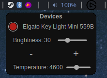

# awesome-keylight-widget

A simple widget for AwesomeWM to control elgato key light.

The widget is based on a bash script to discover key light devices on the network, and changing brightness and temperature as well axs turning on/off the lights.

The bash script is heavily inspired from the [elgato-key-light-linux](https://github.com/nsahq/elgato-key-light-linux?tab=readme-ov-file) project, which uses a json filtering and offers multiple data formating for curl http request to the lights server.

I only have a Key Light Mini for testing the code, so expected some changes for other models..



## Instalation

No instalation is required. Download and copy paste the repo inside your awesome configuration and adapt the script location inside the widget source code to your configuration, and insert the widget into your bar with the following snippet:

```
-- Keylight Widget
local keylight_widget = keylight_widget({icon = beautiful.widget_elgato, font = beautiful.font, space = beautiful.widget_icon_gap})
```

## Dependencies

The script requires avahi-browse, jq and curl to be installed.
```
sudo pacman -S avahi curl jq
```

## Usage

The bash script can also be used as a standalone:

```
Usage: keylight_bash.sh [-h] <action> args

Elgato Lights controller.

Available actions:
    list                    List available lights
    on                      Turn light on               
    off                     Turn light off              
    temperature             Set temperature level (143-344 which range is between 2900 - 7000k)  
    brightness              Set brightness level (0-100)
    change_settings_mini    Change the settings of Keylight Mini 
    battery_bypass          Set battery bypass of Keylight Mini (Studio Mode)


Available options:

-h, --help               Print this help and exit
```
